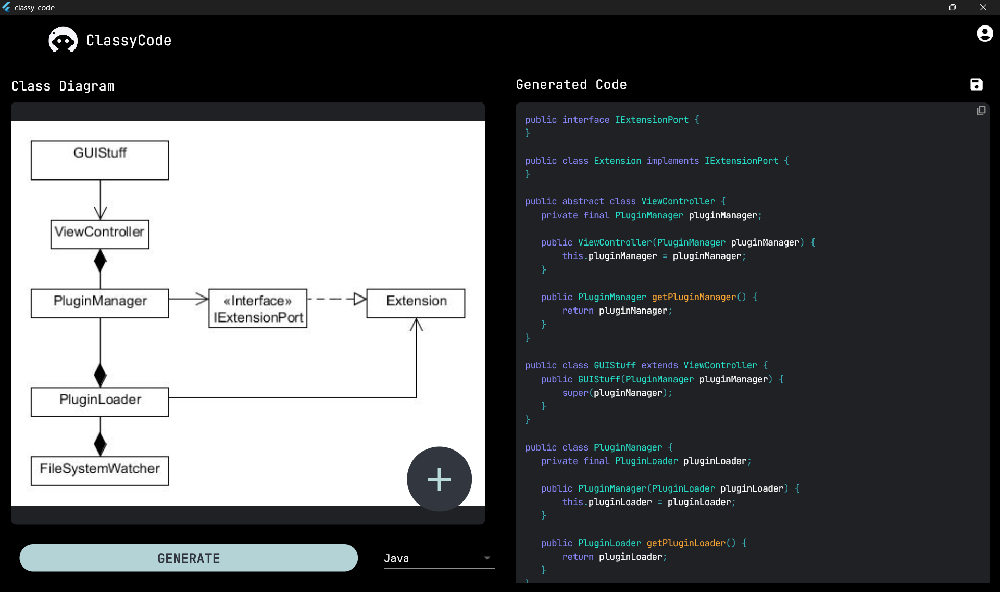

# Classy Code

Classy Code is a [Flutter](https://flutter.dev/) application that generates code from an image of a UML Class Diagram.

## Installation

To install and run this project, you will need to follow these steps:

1. Clone the repository: `git clone https://github.com/yourusername/classy_code.git`
2. Navigate into the project directory: `cd classy_code`
3. Install dependencies: `flutter pub get`
4. Run the app: `flutter run`

## Screenshot
